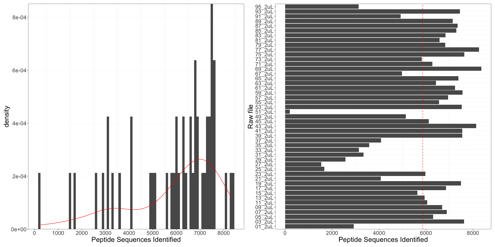
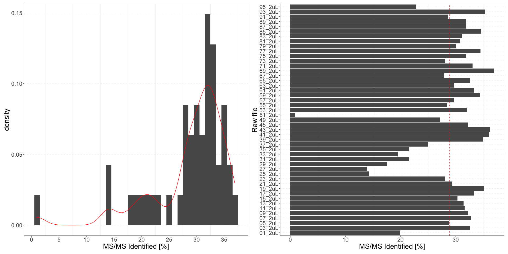
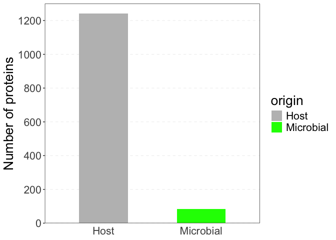
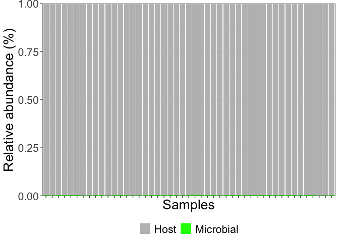

-   [Peptides and MS
    identified](#peptides-and-ms-identified){#toc-peptides-and-ms-identified}
    -   [Peptide sequences
        identified](#peptide-sequences-identified){#toc-peptide-sequences-identified}
    -   [Percentage MS/MS
        identified](#percentage-msms-identified){#toc-percentage-msms-identified}
-   [Origin of proteins](#origin-of-proteins){#toc-origin-of-proteins}
    -   [Number of proteins from host or microbial
        community](#number-of-proteins-from-host-or-microbial-community){#toc-number-of-proteins-from-host-or-microbial-community}
    -   [Abundance of proteins from host and microbial
        community](#abundance-of-proteins-from-host-and-microbial-community){#toc-abundance-of-proteins-from-host-and-microbial-community}

In total 47 samples were analized using MetaLab-Mag v.1.0.1. [MGnify cow
rumen
catalogue](http://ftp.ebi.ac.uk/pub/databases/metagenomics/mgnify_genomes/cow-rumen/v1.0/)
v 1.0 was used to identified microbial proteins, while *Bos taurus*
proteome for host proteins.

## Peptides and MS identified

Across all samples 275,406 peptides sequences were identified and in
average 5,859 peptide sequences were identified per sample. Also the
percentage of MS/MS identified ranged between 0.92% to 36.93%, with an
average of 29.5% per sample.

### Peptide sequences identified

Peptide sequences distribution across samples.

::: cell
`<details>
<summary>`{=html}Code`</summary>`{=html}

``` {.r .cell-code}
histogram <- df_quality %>% 
  filter(`Raw file` != "Total") %>% 
  ggplot(aes(x = `Peptide Sequences Identified`)) +
  geom_histogram(binwidth = 100, aes(y=after_stat(density))) +
  geom_density(color = "red")+ 
  scale_y_continuous(expand = c(0, 0)) +
  scale_x_continuous(breaks = seq(0, 8500, 1000)) +
  theme_bw() +
  theme(
    text = element_text(size = 20),
    panel.grid.major.y = element_line(linetype = 2, linewidth = 0.3),
    panel.grid.minor.y = element_blank(),
    panel.grid.major.x = element_blank())

mean_peptides <- df_quality %>% 
  filter(`Raw file` != "Total") %>% 
  summarise(mean_pep =mean(`Peptide Sequences Identified`) )

barplot <- df_quality %>% 
  filter(`Raw file` != "Total") %>% 
  mutate(`Raw file` = str_remove(`Raw file`, "240410_")) %>% 
  ggplot(aes(y = `Raw file`, x = `Peptide Sequences Identified`)) +
  geom_col() +
  geom_vline(xintercept = mean_peptides$mean_pep, 
             linetype =2, color = "red") +
  theme_bw() +
  theme(
    text = element_text(size = 20),
    panel.grid.major.y = element_line(linetype = 2, linewidth = 0.3),
    panel.grid.minor.y = element_blank(),
    panel.grid.major.x = element_blank())

histogram + barplot
```

```{=html}
</details>
```
::: cell-output-display

:::
:::

### Percentage MS/MS identified

MS/MS identified distribution across samples.

::: cell
`<details>
<summary>`{=html}Code`</summary>`{=html}

``` {.r .cell-code}
histogram_ms <- df_quality %>% 
  filter(`Raw file` != "Total") %>% 
  ggplot(aes(x = `MS/MS Identified [%]`)) +
  geom_histogram(binwidth = 1, aes(y=after_stat(density))) +
  geom_density(color = "red")+ 
  # scale_y_continuous(limits = c(0, 8),
  #                    breaks = seq(1, 8, 1),
  #                    expand = c(0, 0)) +
  scale_x_continuous(breaks = seq(0, 40, 5)) +
  theme_bw() +
  theme(
     text = element_text(size = 20),
        panel.grid.major.y = element_line(linetype = 2, linewidth = 0.3),
        panel.grid.minor.y = element_blank(),
        panel.grid.major.x = element_blank())

mean_ms <- df_quality %>% 
  filter(`Raw file` != "Total") %>% 
  summarise(mean_ms =mean(`MS/MS Identified [%]`) )

barplot_ms <- df_quality %>% 
  filter(`Raw file` != "Total") %>% 
  mutate(`Raw file` = str_remove(`Raw file`, "240410_")) %>% 
  ggplot(aes(y = `Raw file`, x = `MS/MS Identified [%]`)) +
  geom_col() +
  geom_vline(xintercept = mean_ms$mean_ms, 
             linetype =2, color = "red") +
  theme_bw() +
  theme(
    text = element_text(size = 20),
    panel.grid.major.y = element_line(linetype = 2, linewidth = 0.3),
    panel.grid.minor.y = element_blank(),
    panel.grid.major.x = element_blank())

histogram_ms + barplot_ms
```

```{=html}
</details>
```
::: cell-output-display

:::
:::

## Origin of proteins

Protein groups were identified as host or microbial using the protein
IDs.

### Number of proteins from host or microbial community

In total, 1325 protein groups were identified, with the majority of them
belonging to the host (1242). Only 83 proteins were identified as
microbial proteins.

::: cell
`<details>
<summary>`{=html}Code`</summary>`{=html}

``` {.r .cell-code}
protein_origin <- df_origin %>% 
  select(`Majority protein IDs`) %>% 
  separate(`Majority protein IDs`,
           into =c("protein"),
           sep = ";") %>% 
  mutate(origin = if_else(grepl("MGY", protein), "Microbial", "Host")) %>%
  count(origin) 

protein_origin %>% 
  ggplot(aes(x=origin, y=n, fill = origin)) +
  geom_col(width = 0.5)+
  scale_y_continuous(limits = c(0,1300),
                     breaks = seq(0, 1300, 200),
                     expand = c(0,0)) +
  labs(x = NULL,
       y = "Number of proteins") +
  scale_fill_manual(values = c("grey", "green")) +
  theme_bw() +
  theme(text = element_text(size = 20),
        axis.ticks.x = element_blank(),
        panel.grid.major.y = element_line(linetype = 2, linewidth = 0.3),
        panel.grid.minor.y = element_blank(),
        panel.grid.major.x = element_blank()
  )
```

```{=html}
</details>
```
::: cell-output-display

:::
:::

### Abundance of proteins from host and microbial community

In average the host protein groups represent 99.5% of the abundance of
the total identified proteins.

::: cell
`<details>
<summary>`{=html}Code`</summary>`{=html}

``` {.r .cell-code}
df_origin %>% 
  select(`Majority protein IDs`, contains("Intensity")) %>% 
  separate(`Majority protein IDs`,
           into =c("protein"),
           sep = ";") %>% 
  mutate(origin = if_else(grepl("MGY", protein), "Microbial", "Host")) %>% 
  select(-c(Intensity, protein)) %>% 
  pivot_longer(-origin, names_to = "sample", values_to = "intensity") %>% 
  mutate(sample = str_remove(sample, "Intensity 240410_")) %>% 
  group_by(origin, sample) %>% 
  summarise(sum_intensity = sum(intensity), .groups = "drop") %>% 
  group_by(sample) %>% 
  mutate(percent = sum_intensity/sum(sum_intensity)) %>%
  ungroup() %>% 
  ggplot(aes(x = sample,
             y = percent,
             fill = origin)) +
  geom_col() +
  scale_y_continuous(expand = c(0, 0)) +
  scale_fill_manual(values = c("grey", "green")) +
  labs(x = "Samples",
       y = "Relative abundance (%)") +
  theme_bw() +
  theme(text = element_text(size = 20),
        axis.text.x = element_text(angle = 90),
        legend.title = element_blank(),
        axis.text.x.bottom = element_blank(),
        legend.position = "bottom")
```

```{=html}
</details>
```
::: cell-output-display

:::
:::
